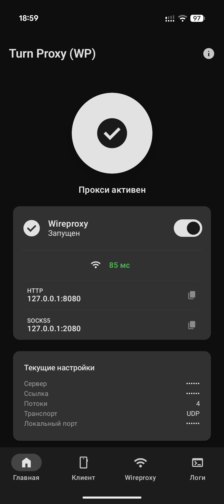

# FreeTurn — Android TURN Proxy

> [!IMPORTANT]  
> **Проект переехал в новый репозиторий: [https://github.com/spkprsnts/WireTurn](https://github.com/spkprsnts/WireTurn)**

Android-клиент для [vk-turn-proxy](https://github.com/cacggghp/vk-turn-proxy) — проброс WireGuard/Hysteria-трафика через TURN-серверы.

> **Disclaimer:** Проект предназначен исключительно для образовательных и исследовательских целей.

## Принцип работы

Пакеты шифруются DTLS 1.2 и отправляются на TURN-сервер по протоколу STUN ChannelData (TCP или UDP). TURN-сервер пересылает трафик по UDP на ваш VPS, где он расшифровывается и передаётся в WireGuard/Hysteria. Учётные данные для TURN генерируются автоматически из ссылки на звонок.

## Возможности

- **GUI и Raw режимы** — удобная форма с полями или ввод аргументов вручную
- **Капча** — автоматическое обнаружение и решение
- **Watchdog** — автоматический перезапуск при обрыве (до 8 попыток, экспоненциальный backoff)
- **Смена сети** — детектирование переключения Wi-Fi/Mobile и автоматическое переподключение
- **Кастомное ядро** — возможность загрузить свой бинарник вместо встроенного
- **Broadcast API** — управление прокси через intent (`START_PROXY` / `STOP_PROXY`) для автоматизации
- ~~**Шифрование секретов** — SSH-пароли и ключи хранятся в EncryptedSharedPreferences (AES-256-GCM, Android Keystore)~~
- ~~**TOFU** — верификация SSH-хостов по отпечатку (Trust On First Use)~~
- ~~**Управление сервером по SSH** — установка, запуск, остановка и мониторинг серверной части прямо из приложения (пароль или SSH-ключ)~~

### Новое
- **Wireproxy** — возможность запускать WireGuard конфиг в качестве прокси
- **История** — последние три ссылки на звонки и адреса сервера сохраняются для быстрого доступа
- **Telemost DC** — встроенное ядро поддерживает Telemost
- **Quick Settings Tile** — быстрый запуск прокси через переключатель в системной шторке.

## Скриншот

<p float="left">
  
</p>

## Требования

- Android 6.0+ (API 26)
- ARM64-устройство (arm64-v8a)
- VPS с установленным WireGuard или Hysteria
- Ссылка на звонок

## Быстрый старт

### 1. Серверная часть

Установите и запустите серверную часть на VPS:

```bash
# Скачать бинарник
wget https://github.com/cacggghp/vk-turn-proxy/releases/latest/download/server-linux-amd64

# Запустить
chmod +x server-linux-amd64
nohup ./server-linux-amd64 -listen 0.0.0.0:56000 -connect 127.0.0.1:<порт_wg> > server.log 2>&1 &
```

### 2. Android-клиент

1. Установите APK из [Releases](https://github.com/spkprsnts/turn-proxy-android-wireproxy/releases/latest)
2. Заполните настройки:
   - **Адрес сервера** — IP:порт вашего VPS (например `1.2.3.4:56000`)
   - **Ссылка** — ссылка на звонок
   - **Локальный адрес** — по умолчанию `127.0.0.1:9000`
3. Нажмите кнопку запуска. При успехе в логах появится `Established DTLS connection!`
4. Для использования Wireproxy загрузите конфиг, убедитесь что Endpoint равен локальному адресу и включите его на главном экране

## Стек

- **Kotlin** + **Jetpack Compose** + **Material 3**
- **Coroutines / StateFlow** — реактивная архитектура
- **DataStore** — хранение настроек
- Нативный бинарник на **Go** — `libvkturn.so` (arm64-v8a)
- Нативный бинарник на **Go** — `libwireproxy.so` (arm64-v8a)

## Благодарности

- [alexmac6574/vk-turn-proxy](https://github.com/alexmac6574/vk-turn-proxy) — [@alexmac6574](https://github.com/alexmac6574), форк ядро vk-turn-proxy
- [cacggghp/vk-turn-proxy](https://github.com/cacggghp/vk-turn-proxy) — [@cacggghp](https://github.com/cacggghp), оригинальное vk-turn-proxy
- [MYSOREZ/vk-turn-proxy-android](https://github.com/MYSOREZ/vk-turn-proxy-android) — [@MYSOREZ](https://github.com/MYSOREZ), оригинальный Android-клиент
- [windtf/wireproxy](https://github.com/windtf/wireproxy) — [@windtf](https://github.com/windtf), клиент wireproxy

## Лицензия

[GPL-3.0](LICENSE)
